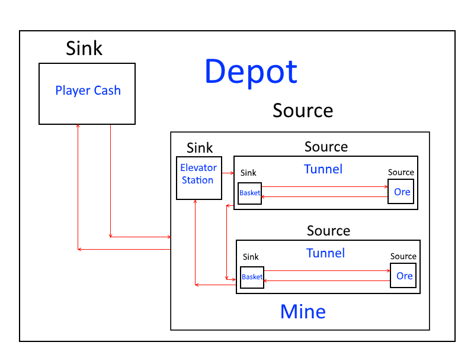

# Dan Miner Tycoon

Enclosed is my clone of Idle Miner Tycoon, developed in Unity 2017.3 over two days. The following document gives an overview of the project's structure, and some notes on implementation details. This will mainly describe the C# code, and not the structure of the Unity scene and assets.

## Project Structure

The structure of the mining system in Dan Miner Tycoon is best described as a series of nested `Pipeline` objects.

A `Pipeline` describes a class representing a system with a number of sources containing resources, a number of workers to extract these resources, a sink to deposit the resources in, and a manager to oversee them. Each `Pipeline` also serves as a source to a parent `Pipeline`. `Pipeline` is an abstract class with three implementations: `Tunnel`, `Mine`, and `Depot`, which each have some domain-specific overrides and extra functionality.

A pipeline has several values which affect the efficiency of its workers, stored in a class called `PipelineStatus`, which is also responsible for upgrades to this efficiency. It calculates a worker's speed and capacity and the cost to upgrade based on its current level, which can be upgraded if the player has sufficient cash (stored in a `CashStore` object discussed below).

A pipeline has multiple `Worker` objects (more than one should only come into play in the Tunnel and Depot pipelines). Workers are very simple - when activated, they visit all the sources in their pipeline (again, more than one source should come into play in the Mine pipeline), gather from these sources up to their maximum load, and once they have either reached their capacity or visited all their sources, they deposit their load in the pipeline's sink. A simple `Manager` object exists in the pipeline and if enabled, simply re-engages `Worker` objects once their

Sources and sinks are both implementations of the abstract class `Endpoint`, which gives them a method to be accessed by a worker, and connects to a `Store` of resources. When `Sink.Access` is called, a worker empties their carrying load and adds it to the attached `Store`. When `Source.Access` is called, a worker extracts the maximum amount available from the `Store` that they can carry. There is one exception to this in the source of the mines, which uses a subclass of `Source` called `UnlimitedSource`, which does not remove resource from any store and simply gives the `Worker` the maximum load they can carry.

The `Store` object contains a private `Quantity` value and two methods to access it, `Deposit` and `Extract`. `Deposit` simply adds a value to the existing quantity, and `Extract` removes the provided amount, to a minimum of zero. However, `Store` has one subclass, `CashStore`, used as the `Store` for the depot's `Sink`, which overrides `Extract` to throw an exception before it proceeds if the new quantity would otherwise go below zero.

The project also contains a number of extension methods within `FloatExtensions` and `TransformExtensions`.

## Future Work

The following are features that I did not manage to complete in time, but would be next on the list:

### Automated testing

See section below in [Areas for Improvement](#Areas-for-Improvement).

### Saving state/Idle resource accrual

This game does not currently save its data (though most of the components are set up to be serialized to do so), and therefore the "Idle" component of "Idle Miner Tycoon" has not been effectively recreated.

How I would imagine idling working is that on close, the application saves its state and the current time as its "last open" timestamp. When opened again, the application would reload the data, check the current time against its "last open" time to get the total time that has elapsed between sessions, then calculate an idle rate for each `Pipeline` from its '`PipelineStatus` and apply the minimum rate from all pipelines to the time elapsed, to get the total accrued while idle.

### Multiple miners and minecarts

Additional miners and minecarts as the player levels up a pipeline is not currently supported.

The way to support this would be similar to the way multiple tunnels are supported: `Pipeline` would include a reference to a prefab for their worker type, and `PipelineStatus` would be given a property to represent its parent `Pipeline`. Then, in a simplistic situation where a new `Worker` is added each level, when the user upgrades the `Pipeline`, if the `Pipeline` supports multiple workers (see thoughts on [Pipeline Polymorphism](#Pipeline-Polymorphism) for how this would be set up), the `PipelineStatus` instantiates a `Worker` of the given prefab with its `Pipeline` as a parent.

### Requiring a cost to enable managers

Managers are currently enabled and disabled with a single click, with no cost associated. This is a low-priority issue with a simple fix of giving the `Manager` object a reference to `PlayerCash` as `PipelineStatus` and `Mine` do, then split the logic in `OnMouseDown` into its own `Enable` function, which tries to extract an upgrade cost from `PlayerCash` before setting `Enabled` to true (instead of what it currently does, which is simply to negate `Enabled` allowing it to be toggled).

### Increasing tunnel efficiency with depth

At the moment, each tunnel is just as efficient as the last, with the same upgrade costs. A simple solution to add this in would be to add `virtual` expression-bodied members to `Pipeline` for `WorkerSpeed` and `WorkerCapacity` that simply return its `PipelineStatus`' value for those properties, but in `Tunnel` these would be overriden to modify the base values by the tunnel's depth.

### Appropriate error handling for insufficient player cash

Currently, the only indication that a player does not have sufficient funds for an upgrade is to throw an exception if a component attempts to extract an amount from `PlayerCash` greater than what it has in its store. This exception could be caught to display an appropriate message.

## Areas for Improvement

The following are areas of my solution that I'm not completely satisfied with, and would be re-addressed given more time.

### Pragmas

In several areas of the codebase, I used a combination of private fields for the purposes of serialization (for example, `_quantity`) and properties which should be used to access them in code (for example, `Quantity`), either for access protection purposes or because the setter of said property involves special functionality.

In order to enforce this behaviour, I added an `Obsolete` attribute to the private fields, which will raise a warning when someone attempts to access them. However, their corresponding properties by necessity must access them, and so I used `#pragma` statements to disable the associated warning within their getter/setter. This ends up being quite verbose once explanatory comments are factored in, and becomes possibly the largest source of repetitive code in the solution.

However, I think the effect of impeding code that would threaten to break the correctness of the program is worth the cost in readability, in this case.

### File/Namespace structure

At the outset of the project, the priority was getting the core loop of the software working as quickly as possible, in order to then re-assess remaining work and structure the rest of the solution appropriately. Once I reached that stage, I attempted to structure the solution into logically separate folders and namespaces, as can be seen in the branch `attempted-structure`.

However, in doing this, the Unity scene lost all its references to Unity scripts and despite the involvement of external tools to try and resolve references, I was unable to get the scene back to where it was, and with the time left I opted to return to the original flat structure rather than rebuild the scene.

### Logic-Interface Coupling

In my relative inexperience with Unity, I was unable to completely separate code related to the core logic of the mining loop from the code related to the user interface, usually through finding related components through the Unity scene's `GameObject` hierarchy, and updating button text and other on-screen data through property setters.

This means that the design of the game logic can sometimes be difficult to parse, as the UI code gets in the way.

### Testing

However, the largest consequence of the above coupling is a lack of testing. With game logic so tied to interface logic, I found that a traditional unit test library would not be able to test how different components interact at runtime. I investigated Unity Play Mode Tests, but could not get these to work in the time available.

This means that this codebase has no automated testing, which would be the first thing I would address if I were to extend this project.

### Pipeline Polymorphism

There is a simplicity to the nested pipeline structure that I think helps to reduce the codebase and improve readability and maintainability. However, an issue that arises from this is where some pipelines should support only one worker, or one source, in order to allow `Pipeline` to support tunnels, mines and depots, each of these types can technically allow for multiple workers (i.e. multiple elevators) and multiple sources (i.e. multiple ore veins in a tunnel).

While an argument could be made that this opens the game up to be extended to include such things, this was an unintended side-effect of the design.

As an example of how to solve the issue with sources, I would remove the `Sources` property from `Pipeline`, and add an abstract method `GetTaskQueue` which could form a worker's task queue (this queue is currently formed in `Worker` itself). I would then set up two interfaces, `ISingleSourcePipeline` and `IMultiSourcePipeline`, and (with proper commenting) leave them empty, but use extension methods to implement `GetTaskQueue` for each of these so that, for example, both `Tunnel` can subclass `Pipeline` and implement `ISingleSourcePipeline` without having to duplicate the implementation of `GetTaskQueue`.
